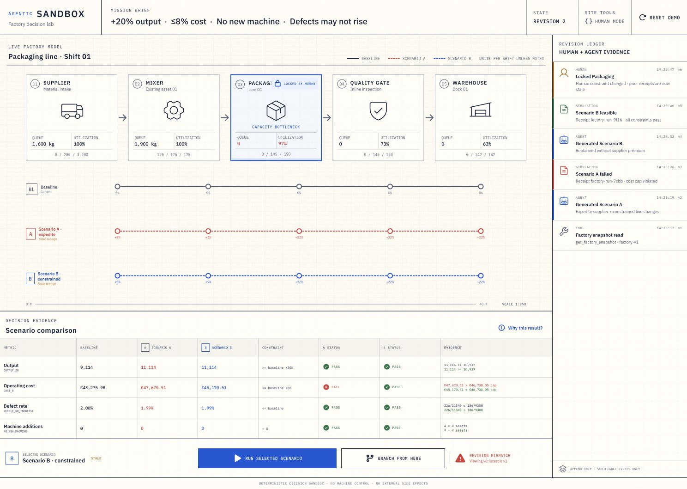

# Agentic Sandbox

**A human changes one rule. The agent's previous plan immediately loses authority.**

Agentic Sandbox is a deterministic factory decision lab where a person and a browser agent plan against the same live, versioned **decision state**. The agent can inspect the line model, create alternatives, apply bounded settings, run a deterministic simulation, and compare immutable receipts. The human can intervene through the visible interface by locking Packaging. Stale agent work then fails closed, the earlier evidence remains inspectable, and the agent must re-read and replan under the new authority boundary.

[Open the live application →](https://webmcp-challenge-seven.vercel.app)



Built for the [OpenAI WebMCP Challenge](https://openai.com/webmcp-challenge/), this is not a chatbot pasted onto a dashboard and it is not an AI control surface for real equipment. It is a shared decision protocol whose human UI and six WebMCP Site Tools use the same application-owned command path. “Live” refers to the planning state on the page; the challenge build has no live plant telemetry or machine-control path.

## The signature interaction

The landing state shows the completed showcase so the result is immediately inspectable. For a live agent run, click **Reset demo** once first. Confirm Packaging now says **Lock resource**, both scenario slots say **Not run**, and the Site Tools status says **WebMCP ready** in a supported host.

Give the browser agent this mission:

> Increase good output by at least 20%. Total cost may rise by at most 8%. Do not add a machine, and do not increase the defect rate. Inspect the factory, build alternatives, simulate them, and compare the evidence.

Then click **Lock resource** on Packaging and add:

> Retry the last Scenario B write once with a fresh request ID but the exact revisions you held before my click. Do not re-read first. Report the structured error. Then re-read the factory, keep Packaging unchanged, replan using only unlocked controls, simulate one shift, and explain the deterministic evidence.

The deliberate stale call is rejected atomically. Nothing is applied to the scenario. After a fresh read, the agent can act only inside the new human-defined boundary. The simulator can then issue a conservative lock-bound proof rather than an unsupported explanation.

That disagreement is the product: the human is not approving opaque agent prose, and the agent is not scraping pixels or silently overriding a changed rule.

## Why WebMCP is essential

Without WebMCP, the agent would have to infer state from pixels and manipulate controls by coordinates, or the product would need a separate chatbot and backend with its own state. Here, the page exposes narrow typed capabilities over the same consequential state, permissions, revisions, and evidence the human sees.

WebMCP provides the missing shared control plane:

- the human sets intent and can change authority in the visible product;
- the agent forms and tests explicit hypotheses through Site Tools;
- a canonical semantic layer defines what controls mean and when they are available;
- the deterministic engine owns every operational number;
- immutable receipts preserve what was attempted, rejected, feasible, historical, and proven;
- the interface renders the same consequential transitions to both participants.

## Agent operating contract

Before each write, an agent should be able to answer:

1. What exact outcome counts as success?
2. Which model, mission, authority, and effective time am I acting on?
3. Which controls exist, what do their values mean, and which are available now?
4. Which evidence is current, historical, or invalid?
5. Which exact identifiers and revisions does the next call require?
6. Is the requested action a legal change, a no-op, or unavailable?
7. Did the previous operation commit?
8. What recovery action is correct after an expected failure?
9. What is the least expensive safe next action?
10. What claim level does the evidence actually justify?

The current challenge build already implements the safety spine: narrow tools, closed schemas, independent input validation, optimistic concurrency, idempotency, human-only locks, immutable receipts, currentness indicators, and fail-closed errors.

The target architecture makes the interface fully coherent and agent-ergonomic through:

- one canonical control definition across schema, validation, unit, range, ownership, phase, evaluator mapping, lock scope, UI, and docs;
- zero hidden dependency on selected UI state;
- explicit planning versus simulation time;
- phase-aware capability metadata;
- semantic no-op normalization;
- copy-ready continuations and complete recovery errors;
- clean post-lock scenario lineage;
- source-bound evidence and comparison eligibility;
- separate execution-validity, currentness, constraint, proof, and decision-relation states;
- evidence reuse and incremental reads.

See [Agent-system design](docs/AGENT_SYSTEM_DESIGN.md), [Agent-system hardening plan](docs/AGENT_SYSTEM_HARDENING_PLAN.md), and [Agent evaluation plan](docs/AGENT_EVAL_PLAN.md). Target additions are not claimed as implemented until code and live replay pass.

## Audience and potential impact

The initial users are plant planners, industrial engineers, and continuous-improvement teams who currently move a single decision across dashboards, spreadsheets, simulation specialists, and approval meetings. Context and authority are lost at each handoff; a generic assistant can make that worse by recommending controls it is no longer allowed to change.

Agentic Sandbox demonstrates a practical adoption wedge for debottlenecking, shift planning, and supplier what-if analysis. In a production version, the embedded deterministic model could be replaced or supplemented by a validated digital twin while the WebMCP contract, receipt trail, human locks, and external approval boundaries remain. ERP, PLC, SCADA, purchase, and physical-machine changes stay outside this system.

The same pattern generalizes to any high-consequence planning UI: bind work to a version, expose narrow capabilities, preserve human vetoes, keep evidence immutable, and distinguish observed failure from mathematical infeasibility.

## Six browser-native Site Tools

The top-level page registers exactly six imperative tools through `document.modelContext.registerTool(...)`.

| Tool | Kind | Agent question |
| --- | --- | --- |
| `get_factory_snapshot` | Read | What decision context, mission, locks, baseline, bottlenecks, and scenario heads exist now? |
| `get_scenario_snapshot` | Read | What exact scenario head and receipt exist, and is the source still current? |
| `create_scenario` | Write | Create a named planning branch from the expected factory and lock revisions. |
| `apply_scenario_changes` | Write | Atomically commit bounded absolute settings to the expected scenario head. |
| `run_factory_simulation` | Write | Run and store one deterministic 16-hour, 64-tick shift receipt. |
| `compare_simulation_runs` | Read | Compare two to four immutable receipts using exact deltas and constraints. |

There is deliberately no `lock`, `unlock`, `force`, `approve`, arbitrary patch, optimizer, or machine-control tool. Human locks exist only in the visible interface.

The registration layer feature-detects WebMCP, remains stable across React Strict Mode and HMR, validates arguments independently of JSON Schema, propagates cancellation, sanitizes unexpected errors, and returns a closed `factory-tools/v1` JSON envelope.

## Current control loop

```text
get_factory_snapshot
        │
        ├─> create_scenario ─> apply_scenario_changes ─> run_factory_simulation
        │
        ├─> create_scenario ─> apply_scenario_changes ─> run_factory_simulation
        │
        └─> compare_simulation_runs

human locks Packaging
        │
        ├─> stale write rejected; no scenario state mutates
        ├─> get_factory_snapshot
        └─> replan under the new lock ─> run_factory_simulation ─> exact proof
```

The verified workflow keeps orientation, hypothesis, mutation, evaluation, comparison, conflict, recovery, and proof as separate inspectable boundaries. The initial two-scenario decision takes eight Site Tool calls: one orientation, create/apply/run twice, then compare.

The hardened target adds a **clean post-lock scenario head** rather than merging unlocked changes into the pre-lock head. While retaining the current public grammar, that clean recovery is four calls after the intentional stale response: refresh, create, apply, simulate.

Resource efficiency should come from copy-ready continuations, no-op normalization, compact receipts, evidence reuse, and incremental reads—not from hiding the workflow inside one mega-tool.

## Why the evidence is trustworthy

The model never supplies a displayed KPI. The local engine computes every claim with integer or fixed-point arithmetic and produces a content-addressed SHA-256 receipt containing:

- immutable input and engine hashes;
- accepted and rejected operations;
- 64 deterministic tick snapshots;
- exact good-output, defect, energy, and cost counters;
- a category-level cost ledger;
- four constraint checks with exact operands;
- conservation and asset-inventory invariants;
- bottleneck evidence;
- a lock-bound upper-limit proof when applicable.

The seeded acceptance cases are intentionally easy to audit:

| Case | Good output | Result |
| --- | ---: | --- |
| Baseline | 9,114 | Reference receipt |
| Constrained plan | 11,114 | All four constraints pass |
| Expedite plan | 11,114 | Fails the 8% cost cap and is output-equivalent but more expensive |
| Packaging locked at tick 16 | ≤9,252 upper bound | Target 10,937 is proven unreachable under the modeled lock |

The lock click is a planning-time event. The deterministic counterfactual models its effect at tick 16, four hours into the 16-hour shift. The target system derives this timing and the blocked control set from one canonical lock contract and renders them consistently in tool output, UI, proof, tests, and documentation.

Scenario B is better among the two demonstrated current alternatives. The comparison does not establish global optimality.

## State, idempotency, and recovery

Every mutation carries a request ID plus expected factory, scenario, and human-lock revisions.

- After a successful synchronous commit, the same request ID and identical payload replay the committed result.
- Reusing a request ID with different arguments fails.
- A stale or locked batch applies nothing.
- Failed or aborted asynchronous simulation operations do not remain permanently reserved.
- Replaying a successful simulation preserves the original receipt while recalculating whether its source is still current.
- A committed domain outcome remains authoritative even if a later presentation-layer visibility wait is throttled or fails.

The hardened target additionally makes semantic no-ops non-mutating, source currentness reasoned rather than merely boolean, and historical/invalid evidence ineligible for an unlabeled current winner.

## Architecture

```text
Human controls ─┐
                ├─> shared command protocol ─> deterministic engine
WebMCP tools ───┘             │                         │
                              ├─> authority epoch       │
                              ├─> scenario lineage      │
                              ├─> immutable run store   │
                              ├─> evidence graph        │
                              └─> shared UI projection <┘
```

- `src/domain/` contains the simulator, fixtures, hashes, constraints, invariants, and receipts.
- `src/app/` owns scenario state, idempotency, optimistic concurrency, human locks, and the shared command bus.
- `src/webmcp/` owns registration, schemas, runtime validation, tool envelopes, and browser lifecycle handling.
- `src/ui/` renders the precision-blueprint factory, comparison evidence, lock state, and revision ledger.
- `docs/AGENT_SYSTEM_DESIGN.md` defines the normative linked abstraction tower.
- `docs/AGENT_SYSTEM_HARDENING_PLAN.md` records the code-audited seams and implementation sequence.
- `docs/AGENT_EVAL_PLAN.md` defines trace-level semantic, correctness, recovery, evidence, and resource gates.

Everything runs locally in the page. There is no model API key, backend, account, purchase, telemetry, PLC, SCADA, or physical-machine integration.

## Safety boundaries

- This is a decision sandbox, not a production-control surface.
- Tool definitions, arguments, names, and results are treated as untrusted input.
- Schemas are closed and handlers validate independently before execution.
- Mutations fail closed on stale factory, scenario, or lock revisions.
- Human locks win and have no agent-accessible override.
- The baseline and stored receipts are immutable.
- A rejected call changes no scenario state.
- Normal human controls remain available when WebMCP is absent.
- The agent may explain evidence but cannot author operational facts.
- User/agent labels are display text and cannot affect routing, evaluation, currentness, or selection.

## Local development

Requirements: a current Node.js release and npm.

```bash
npm install
npm run dev
```

Open the URL printed by Vite. The human interface works in browsers without WebMCP. In ChatGPT's built-in browser, Site Tools are discovered from the top-level document. In a compatible Chrome build, enable the WebMCP testing flag or use the relevant origin trial.

Run the complete local gate:

```bash
npm run verify
```

Useful focused commands:

```bash
npm run typecheck
npm test
npm run build
```

## Deployment

The repository is self-contained and needs no environment variables or backend. `vercel.json` pins the Vite output directory to `dist/client`, so a Vercel project can build it without a dashboard-only output override. Before sharing with judges, confirm the deployment is public, HTTPS, and not protected by a login wall.

## Challenge material

- [Product brief](docs/PRODUCT_BRIEF.md)
- [Agent-system design](docs/AGENT_SYSTEM_DESIGN.md)
- [Agent-system hardening plan](docs/AGENT_SYSTEM_HARDENING_PLAN.md)
- [Agent evaluation plan](docs/AGENT_EVAL_PLAN.md)
- [Three-minute demo script](docs/DEMO_SCRIPT.md)
- [Submission copy](docs/SUBMISSION.md)
- [Submission readiness](docs/SUBMISSION_READINESS.md)
- [Asset provenance](docs/ASSET_PROVENANCE.md)
- [Visual QA report](design-qa.md)
- [Selected visual target](docs/visual-target-precision-blueprint.png)

Built against the current [OpenAI Site Tools guide](https://learn.chatgpt.com/docs/webmcp) and [WebMCP draft specification](https://webmachinelearning.github.io/webmcp/).

## License

[MIT](LICENSE)
